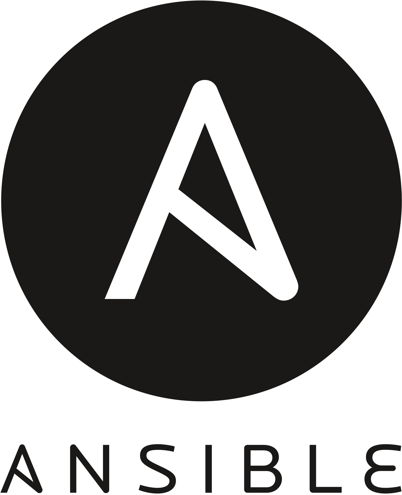

<h1 align="left">🤩 About me</h1>

My life turns around 🚀Technology💻, 🧪Science🔭 and Basket
 My tech journey is consisting of very nerdy stuffs like Java, Angular, K8s, Docker, Linux, Terraform, Ansible and So on (Like All DevOps Stuffs).</strong>

 

<h1 align="left">📞 Let's Meet ☎</h1>

 

  

________
 

<h1 align="left">😉 Some Stats !</h1>

<!--  
<h2 align="left">Github Resume</h2>

 -->
<!-- 

   
  
 -->
